# 开源大语言模型原生即时通信机器人开发平台设计文档

## 1. 概述

### 1.1 项目愿景
构建一个功能完备的开源大语言模型原生即时通信机器人开发平台，提供开箱即用的 IM 机器人开发体验，支持 Agent、RAG、MCP 等多种 LLM 应用功能，适配国内主流即时通信平台。

### 1.2 核心特性
- 💬 **大模型对话与 Agent**：支持多种大模型、多轮对话、工具调用、多模态、流式输出
- 🤖 **多平台支持**：QQ、QQ频道、企业微信、个人微信
- 🛠️ **高稳定性与功能完备**：访问控制、限速、敏感词过滤、多流水线配置
- 🧩 **插件扩展**：事件驱动、组件扩展、MCP 协议适配
- 😻 **Web 管理面板**：浏览器管理实例，动态配置，模型切换

### 1.3 技术栈
- **后端框架**：Python FastAPI
- **前端框架**：Vue 3 + TypeScript + Element Plus
- **数据库**：MySQL + Redis
- **消息队列**：Redis Pub/Sub
- **容器化**：Docker + Docker Compose
- **AI框架**：LangChain + Dify 适配器

## 2. 系统架构

### 2.1 整体架构图

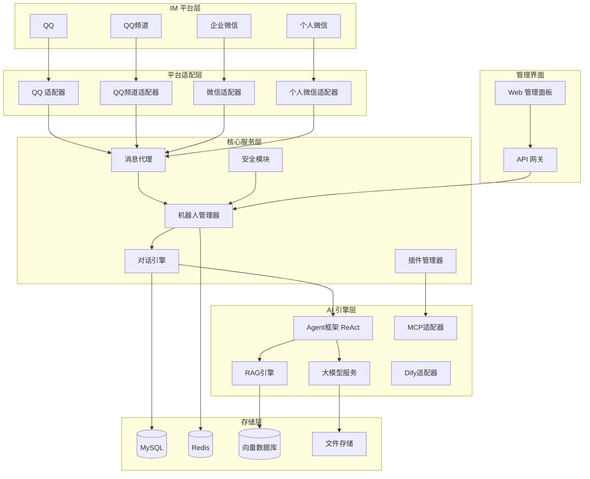
```mermaid
graph TB
    subgraph "IM 平台层"
        QQ[QQ]
        QQChannel[QQ频道]
        WeChat[企业微信]
        WeChatPersonal[个人微信]
    end
    
    subgraph "平台适配层"
        QQAdapter[QQ 适配器]
        QQChannelAdapter[QQ频道适配器]
        WeChatAdapter[微信适配器]
        WeChatPersonalAdapter[个人微信适配器]
    end
    
    subgraph "核心服务层"
        MessageBroker[消息代理]
        BotManager[机器人管理器]
        ConversationEngine[对话引擎]
        PluginManager[插件管理器]
        SecurityModule[安全模块]
    end
    
    subgraph "AI 引擎层"
        LLMService[大模型服务]
        AgentFramework[Agent框架 ReAct]
        RAGEngine[RAG引擎]
        MCPAdapter[MCP适配器]
        DifyAdapter[Dify适配器]
    end
    
    subgraph "存储层"
        MySQLDB[(MySQL)]
        RedisCache[(Redis)]
        VectorDB[(向量数据库)]
        FileStorage[文件存储]
    end
    
    subgraph "管理界面"
        WebUI[Web 管理面板]
        APIGateway[API 网关]
    end
    
    QQ --> QQAdapter
    QQChannel --> QQChannelAdapter
    WeChat --> WeChatAdapter
    WeChatPersonal --> WeChatPersonalAdapter
    
    QQAdapter --> MessageBroker
    QQChannelAdapter --> MessageBroker
    WeChatAdapter --> MessageBroker
    WeChatPersonalAdapter --> MessageBroker
    
    MessageBroker --> BotManager
    BotManager --> ConversationEngine
    ConversationEngine --> AgentFramework
    AgentFramework --> LLMService
    AgentFramework --> RAGEngine
    
    PluginManager --> MCPAdapter
    SecurityModule --> BotManager
    
    WebUI --> APIGateway
    APIGateway --> BotManager
    
    ConversationEngine --> MySQLDB
    BotManager --> RedisCache
    RAGEngine --> VectorDB
    LLMService --> FileStorage
```

### 2.2 分层架构设计

#### 2.2.1 平台适配层 (Platform Adapter Layer)
负责不同IM平台的协议适配和消息转换。

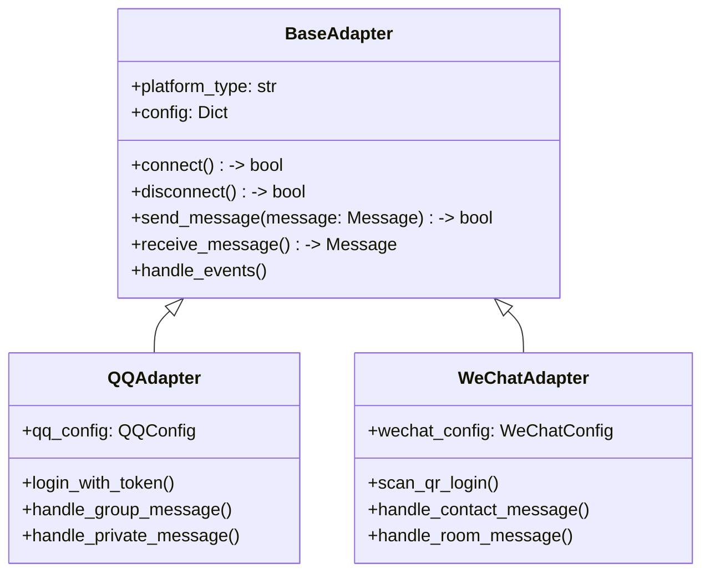
```mermaid
classDiagram
    class BaseAdapter {
        +platform_type: str
        +config: Dict
        +connect() -> bool
        +disconnect() -> bool
        +send_message(message: Message) -> bool
        +receive_message() -> Message
        +handle_events()
    }
    
    class QQAdapter {
        +qq_config: QQConfig
        +login_with_token()
        +handle_group_message()
        +handle_private_message()
    }
    
    class WeChatAdapter {
        +wechat_config: WeChatConfig
        +scan_qr_login()
        +handle_contact_message()
        +handle_room_message()
    }
    
    BaseAdapter <|-- QQAdapter
    BaseAdapter <|-- WeChatAdapter
```

#### 2.2.2 消息代理层 (Message Broker)
统一处理来自不同平台的消息，实现消息队列和路由。

#### 2.2.3 机器人管理层 (Bot Management)
管理多个机器人实例，支持多流水线配置。

#### 2.2.4 AI引擎层 (AI Engine)
集成大模型服务和智能体框架。

## 3. 核心功能模块

### 3.1 Agent 智能体框架 (ReAct)

#### 3.1.1 ReAct 框架实现

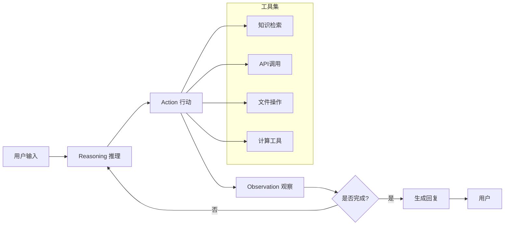
```mermaid
graph LR
    A[用户输入] --> B[Reasoning 推理]
    B --> C[Action 行动]
    C --> D[Observation 观察]
    D --> E{是否完成?}
    E -->|否| B
    E -->|是| F[生成回复]
    F --> G[用户]
    
    subgraph "工具集"
        T1[知识检索]
        T2[API调用]
        T3[文件操作]
        T4[计算工具]
    end
    
    C --> T1
    C --> T2
    C --> T3
    C --> T4
```

#### 3.1.2 Agent 配置结构

| 组件 | 功能 | 配置项 |
|------|------|--------|
| **推理器** | 分析用户意图，制定行动计划 | 推理模型、最大推理步数、思维链模式 |
| **工具集** | 提供外部能力扩展 | 工具列表、权限控制、超时设置 |
| **记忆模块** | 维护对话上下文 | 记忆类型、窗口大小、压缩策略 |
| **观察器** | 监控执行结果 | 结果解析、错误处理、重试机制 |

### 3.2 RAG 知识库系统

#### 3.2.1 RAG 架构设计

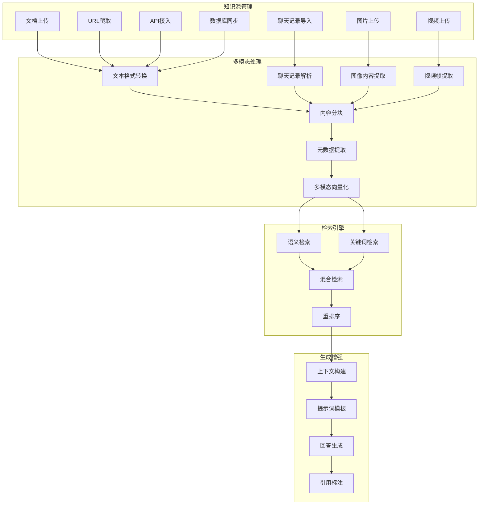
```mermaid
graph TB
    subgraph "知识源管理"
        A1[文档上传]
        A2[聊天记录导入]
        A3[图片上传]
        A4[视频上传]
        A5[URL爬取]
        A6[API接入]
        A7[数据库同步]
    end
    
    subgraph "多模态处理"
        B1[文本格式转换]
        B2[聊天记录解析]
        B3[图像内容提取]
        B4[视频帧提取]
        B5[内容分块]
        B6[元数据提取]
        B7[多模态向量化]
    end
    
    subgraph "检索引擎"
        C1[语义检索]
        C2[关键词检索]
        C3[混合检索]
        C4[重排序]
    end
    
    subgraph "生成增强"
        D1[上下文构建]
        D2[提示词模板]
        D3[回答生成]
        D4[引用标注]
    end
    
    A1 --> B1
    A2 --> B2
    A3 --> B3
    A4 --> B4
    A5 --> B1
    A6 --> B1
    A7 --> B1
    
    B1 --> B5
    B2 --> B5
    B3 --> B5
    B4 --> B5
    B5 --> B6
    B6 --> B7
    
    B7 --> C1
    B7 --> C2
    C1 --> C3
    C2 --> C3
    C3 --> C4
    
    C4 --> D1
    D1 --> D2
    D2 --> D3
    D3 --> D4
```

#### 3.2.2 知识库功能特性

| 功能模块 | 核心能力 | 技术实现 |
|----------|----------|----------|
| **文档解析** | 支持PDF、Word、Markdown、HTML等格式 | 文档解析器 + 格式标准化 |
| **聊天记录处理** | 导入聊天记录，提取对话上下文 | 聊天记录解析器 + 对话分段 |
| **图像理解** | 图片内容识别、OCR文字提取 | 多模态模型 + OCR引擎 |
| **视频处理** | 视频帧提取、音频转文字 | 视频解码 + ASR语音识别 |
| **智能分块** | 语义感知的内容分块策略 | 基于语义相似度的动态分块 |
| **多模态向量化** | 文本、图像、音频统一向量化 | 多模态Embedding模型 |
| **混合检索** | 跨模态语义检索 | 多模态向量检索 + 重排序 |
| **向量库管理** | 本地/云端向量库自由切换 | 统一向量库接口 + 配置管理 |
| **实时更新** | 支持知识库增量更新 | 变更检测 + 增量索引 |

### 3.2.3 多模态知识库管理

#### 3.2.3.1 知识源类型支持

| 知识源类型 | 支持格式 | 处理方式 | 向量化策略 |
|------------|----------|----------|----------|
| **结构化文档** | PDF, DOCX, PPTX, XLSX | 文档解析 + 分块 | 文本Embedding |
| **非结构化文本** | TXT, MD, HTML, JSON | 直接分块 | 文本Embedding |
| **聊天记录** | JSON, CSV, 文本格式 | 对话分段 + 上下文提取 | 对话向量化 |
| **图像文件** | JPG, PNG, GIF, WEBP | OCR + 图像理解 | 多模态Embedding |
| **视频文件** | MP4, AVI, MOV, FLV | 关键帧提取 + ASR | 视频+音频向量化 |
| **音频文件** | MP3, WAV, AAC, M4A | 语音转文字 | 音频特征向量化 |

#### 3.2.3.2 聊天记录处理流程

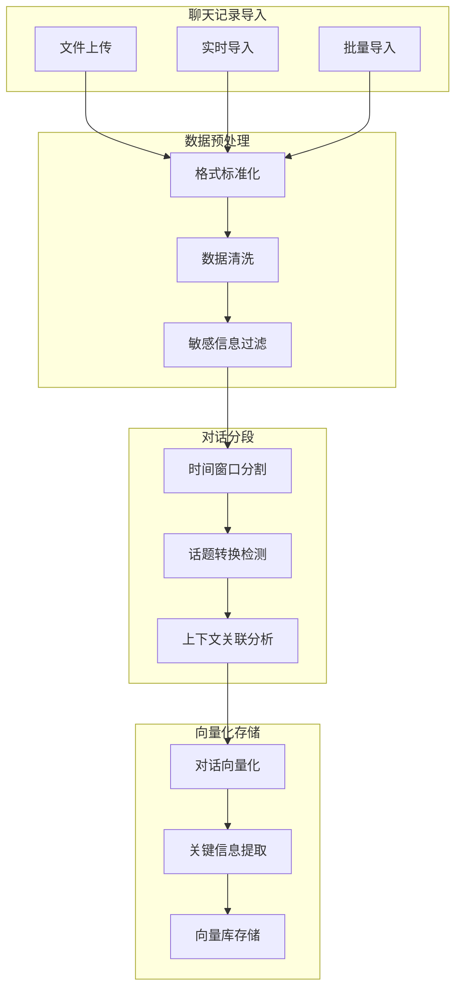
```mermaid
graph TB
    subgraph "聊天记录导入"
        A1[文件上传]
        A2[实时导入]
        A3[批量导入]
    end
    
    subgraph "数据预处理"
        B1[格式标准化]
        B2[数据清洗]
        B3[敏感信息过滤]
    end
    
    subgraph "对话分段"
        C1[时间窗口分割]
        C2[话题转换检测]
        C3[上下文关联分析]
    end
    
    subgraph "向量化存储"
        D1[对话向量化]
        D2[关键信息提取]
        D3[向量库存储]
    end
    
    A1 --> B1
    A2 --> B1
    A3 --> B1
    
    B1 --> B2
    B2 --> B3
    
    B3 --> C1
    C1 --> C2
    C2 --> C3
    
    C3 --> D1
    D1 --> D2
    D2 --> D3
```

#### 3.2.3.3 多模态内容处理

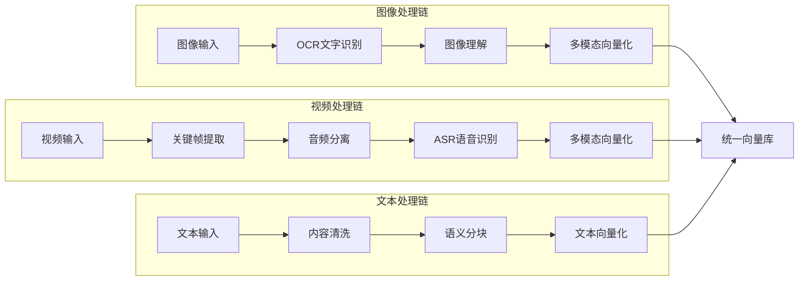
```mermaid
graph LR
    subgraph "图像处理链"
        A1[图像输入] --> A2[OCR文字识别]
        A2 --> A3[图像理解]
        A3 --> A4[多模态向量化]
    end
    
    subgraph "视频处理链"
        B1[视频输入] --> B2[关键帧提取]
        B2 --> B3[音频分离]
        B3 --> B4[ASR语音识别]
        B4 --> B5[多模态向量化]
    end
    
    subgraph "文本处理链"
        C1[文本输入] --> C2[内容清洗]
        C2 --> C3[语义分块]
        C3 --> C4[文本向量化]
    end
    
    A4 --> D[统一向量库]
    B5 --> D
    C4 --> D
```

### 3.2.4 向量数据库管理系统

#### 3.2.4.1 向量库架构设计

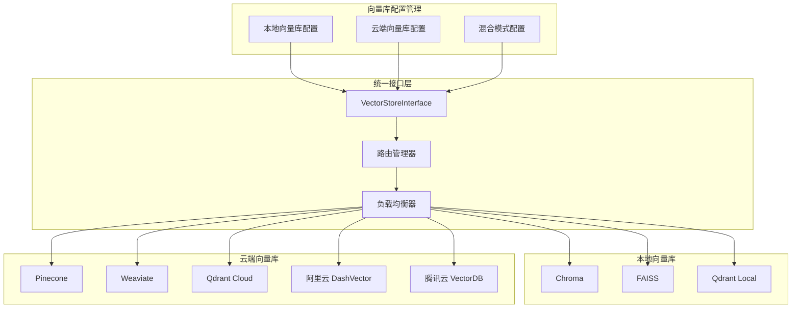
```mermaid
graph TB
    subgraph "向量库配置管理"
        A1[本地向量库配置]
        A2[云端向量库配置]
        A3[混合模式配置]
    end
    
    subgraph "统一接口层"
        B1[VectorStoreInterface]
        B2[路由管理器]
        B3[负载均衡器]
    end
    
    subgraph "本地向量库"
        C1[Chroma]
        C2[FAISS]
        C3[Qdrant Local]
    end
    
    subgraph "云端向量库"
        D1[Pinecone]
        D2[Weaviate]
        D3[Qdrant Cloud]
        D4[阿里云 DashVector]
        D5[腾讯云 VectorDB]
    end
    
    A1 --> B1
    A2 --> B1
    A3 --> B1
    
    B1 --> B2
    B2 --> B3
    
    B3 --> C1
    B3 --> C2
    B3 --> C3
    B3 --> D1
    B3 --> D2
    B3 --> D3
    B3 --> D4
    B3 --> D5
```

#### 3.2.4.2 向量库切换管理

| 配置类型 | 优势 | 限制 | 适用场景 |
|----------|------|------|----------|
| **本地向量库** | 无网络依赖，响应快，数据隐私 | 存储容量有限，扩展性差 | 小型部署，敏感数据 |
| **云端向量库** | 无限存储，高可用性，易扩展 | 网络延迟，成本较高 | 大型应用，生产环境 |
| **混合模式** | 平衡性能和成本，灵活配置 | 管理复杂度高 | 中大型企业 |

#### 3.2.4.3 向量库参数配置

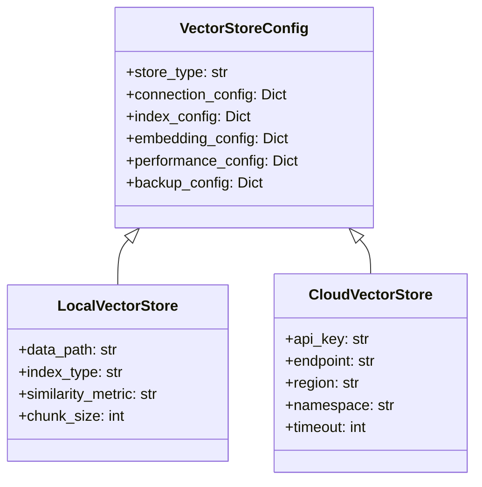
```mermaid
classDiagram
    class VectorStoreConfig {
        +store_type: str
        +connection_config: Dict
        +index_config: Dict
        +embedding_config: Dict
        +performance_config: Dict
        +backup_config: Dict
    }
    
    class LocalVectorStore {
        +data_path: str
        +index_type: str
        +similarity_metric: str
        +chunk_size: int
    }
    
    class CloudVectorStore {
        +api_key: str
        +endpoint: str
        +region: str
        +namespace: str
        +timeout: int
    }
    
    VectorStoreConfig <|-- LocalVectorStore
    VectorStoreConfig <|-- CloudVectorStore
```

### 3.3 MCP (Model Context Protocol) 适配

#### 3.3.1 MCP 协议集成

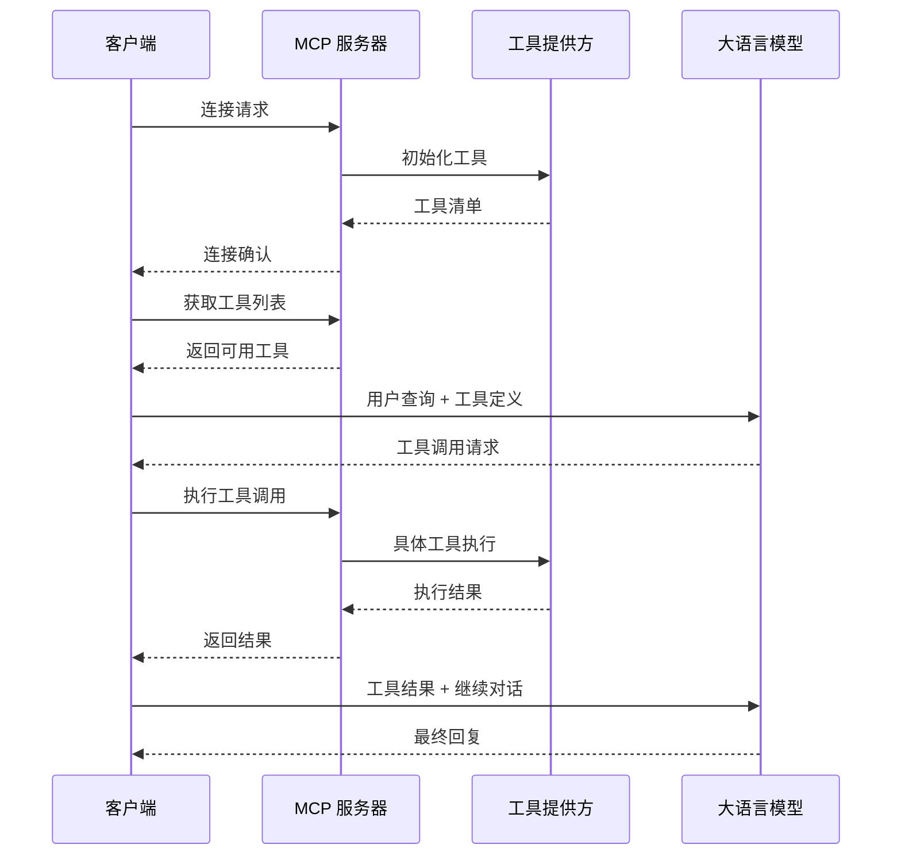
```mermaid
sequenceDiagram
    participant Client as 客户端
    participant MCPServer as MCP 服务器
    participant Tool as 工具提供方
    participant LLM as 大语言模型
    
    Client->>MCPServer: 连接请求
    MCPServer->>Tool: 初始化工具
    Tool-->>MCPServer: 工具清单
    MCPServer-->>Client: 连接确认
    
    Client->>MCPServer: 获取工具列表
    MCPServer-->>Client: 返回可用工具
    
    Client->>LLM: 用户查询 + 工具定义
    LLM-->>Client: 工具调用请求
    
    Client->>MCPServer: 执行工具调用
    MCPServer->>Tool: 具体工具执行
    Tool-->>MCPServer: 执行结果
    MCPServer-->>Client: 返回结果
    
    Client->>LLM: 工具结果 + 继续对话
    LLM-->>Client: 最终回复
```

#### 3.3.2 MCP 工具生态

| 工具类别 | 典型工具 | 应用场景 |
|----------|----------|----------|
| **数据查询** | 数据库查询、API 调用 | 实时数据获取 |
| **文件操作** | 文件读写、格式转换 | 文档处理 |
| **网络服务** | 网页抓取、邮件发送 | 外部服务集成 |
| **计算工具** | 数学计算、数据分析 | 复杂计算任务 |
| **自定义工具** | 业务特定功能 | 定制化需求 |

### 3.4 多模态处理能力

#### 3.4.1 多模态输入处理

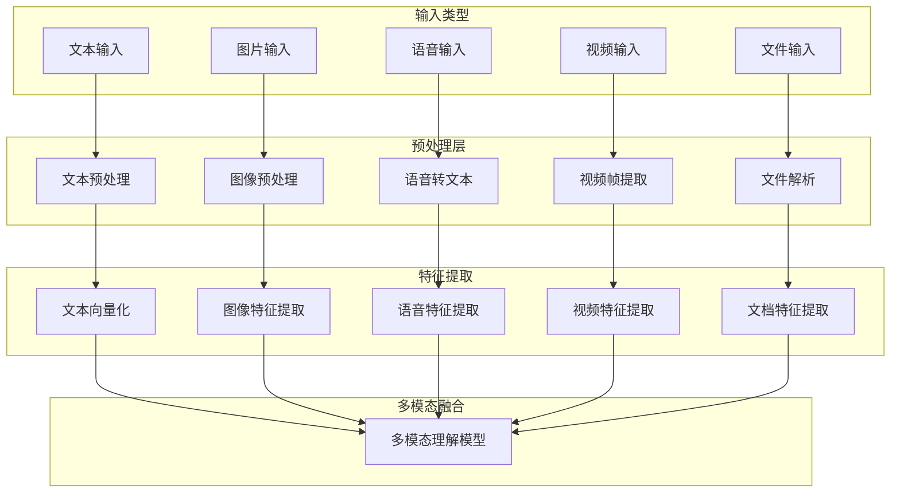
```mermaid
graph TB
    subgraph "输入类型"
        A1[文本输入]
        A2[图片输入]
        A3[语音输入]
        A4[视频输入]
        A5[文件输入]
    end
    
    subgraph "预处理层"
        B1[文本预处理]
        B2[图像预处理]
        B3[语音转文本]
        B4[视频帧提取]
        B5[文件解析]
    end
    
    subgraph "特征提取"
        C1[文本向量化]
        C2[图像特征提取]
        C3[语音特征提取]
        C4[视频特征提取]
        C5[文档特征提取]
    end
    
    subgraph "多模态融合"
        D[多模态理解模型]
    end
    
    A1 --> B1 --> C1 --> D
    A2 --> B2 --> C2 --> D
    A3 --> B3 --> C3 --> D
    A4 --> B4 --> C4 --> D
    A5 --> B5 --> C5 --> D
```

## 4. 平台适配实现

### 4.1 即时通信平台支持

#### 4.1.1 平台适配器设计

| 平台 | 适配方式 | 主要功能 | 技术方案 |
|------|----------|----------|----------|
| **QQ** | QQ Bot API | 群聊、私聊、文件传输 | go-cqhttp + HTTP API |
| **QQ频道** | QQ频道 Bot API | 频道消息、子频道管理 | 官方 Bot SDK |
| **企业微信** | 企业微信 API | 应用消息、群机器人 | 企业微信 SDK |
| **个人微信** | Wechaty 框架 | 好友聊天、群聊 | Wechaty + Puppet |

#### 4.1.2 消息类型处理

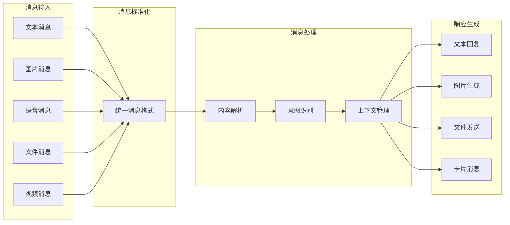
```mermaid
graph LR
    subgraph "消息输入"
        A1[文本消息]
        A2[图片消息]
        A3[语音消息]
        A4[文件消息]
        A5[视频消息]
    end
    
    subgraph "消息标准化"
        B[统一消息格式]
    end
    
    subgraph "消息处理"
        C1[内容解析]
        C2[意图识别]
        C3[上下文管理]
    end
    
    subgraph "响应生成"
        D1[文本回复]
        D2[图片生成]
        D3[文件发送]
        D4[卡片消息]
    end
    
    A1 --> B
    A2 --> B
    A3 --> B
    A4 --> B
    A5 --> B
    
    B --> C1
    C1 --> C2
    C2 --> C3
    
    C3 --> D1
    C3 --> D2
    C3 --> D3
    C3 --> D4
```

### 4.2 统一消息协议

#### 4.2.1 消息数据结构

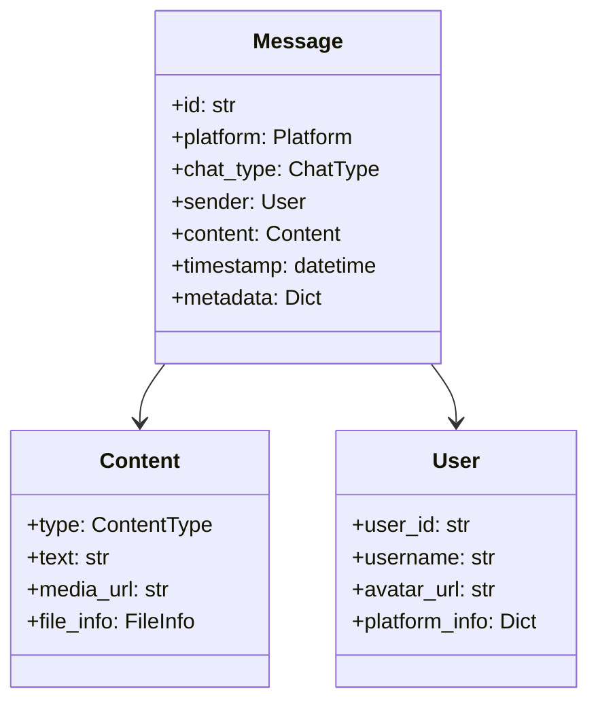
```mermaid
classDiagram
    class Message {
        +id: str
        +platform: Platform
        +chat_type: ChatType
        +sender: User
        +content: Content
        +timestamp: datetime
        +metadata: Dict
    }
    
    class Content {
        +type: ContentType
        +text: str
        +media_url: str
        +file_info: FileInfo
    }
    
    class User {
        +user_id: str
        +username: str
        +avatar_url: str
        +platform_info: Dict
    }
    
    Message --> Content
    Message --> User
```

## 5. 安全与访问控制

### 5.1 安全机制设计

#### 5.1.1 多层安全防护

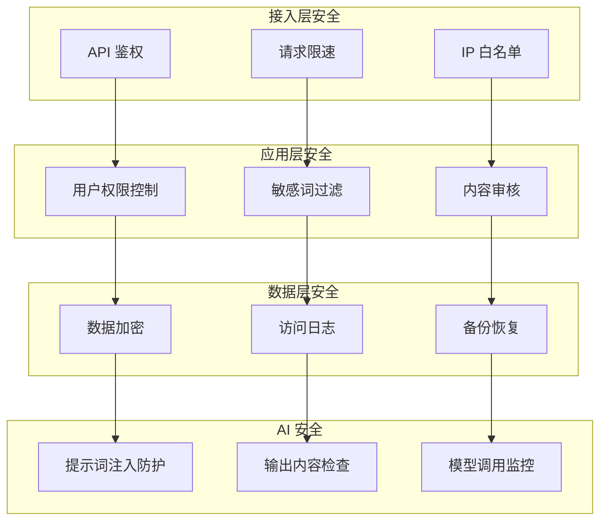
```mermaid
graph TB
    subgraph "接入层安全"
        A1[API 鉴权]
        A2[请求限速]
        A3[IP 白名单]
    end
    
    subgraph "应用层安全"
        B1[用户权限控制]
        B2[敏感词过滤]
        B3[内容审核]
    end
    
    subgraph "数据层安全"
        C1[数据加密]
        C2[访问日志]
        C3[备份恢复]
    end
    
    subgraph "AI 安全"
        D1[提示词注入防护]
        D2[输出内容检查]
        D3[模型调用监控]
    end
    
    A1 --> B1
    A2 --> B2
    A3 --> B3
    
    B1 --> C1
    B2 --> C2
    B3 --> C3
    
    C1 --> D1
    C2 --> D2
    C3 --> D3
```

#### 5.1.2 访问控制表

| 控制维度 | 控制粒度 | 配置选项 |
|----------|----------|----------|
| **用户权限** | 用户ID、用户组 | 允许列表、黑名单、权限等级 |
| **功能权限** | 功能模块、API接口 | 功能开关、调用频次、时间窗口 |
| **平台权限** | IM平台、聊天群组 | 平台白名单、群组授权 |
| **内容过滤** | 关键词、正则表达式 | 敏感词库、自定义规则 |

### 5.2 限速与熔断机制

#### 5.2.1 多级限速策略

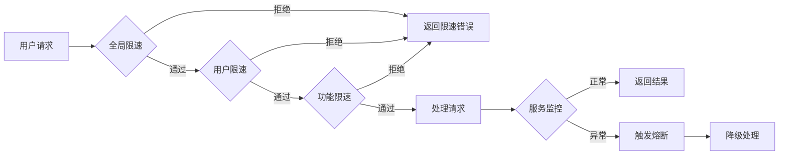
```mermaid
graph LR
    A[用户请求] --> B{全局限速}
    B -->|通过| C{用户限速}
    B -->|拒绝| D[返回限速错误]
    C -->|通过| E{功能限速}
    C -->|拒绝| D
    E -->|通过| F[处理请求]
    E -->|拒绝| D
    
    F --> G{服务监控}
    G -->|正常| H[返回结果]
    G -->|异常| I[触发熔断]
    I --> J[降级处理]
```

## 6. 插件扩展系统

### 6.1 插件架构设计

#### 6.1.1 插件生命周期管理

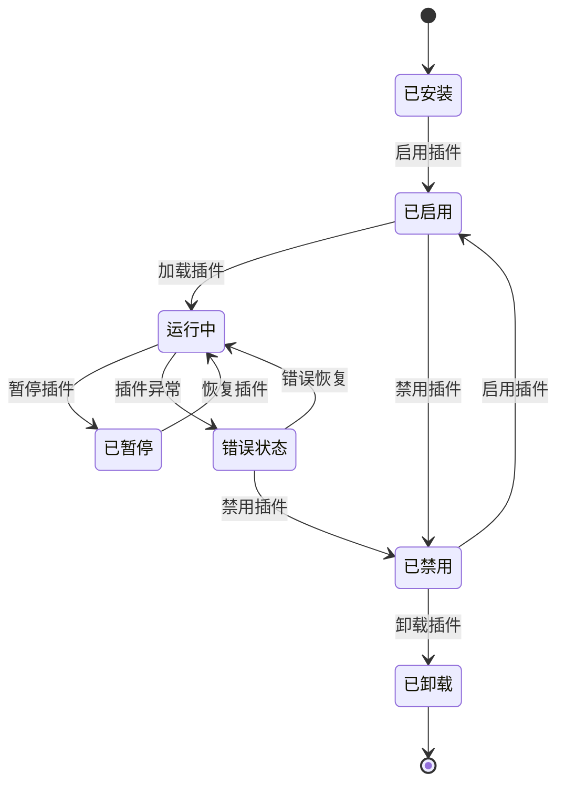
```mermaid
stateDiagram-v2
    [*] --> 已安装
    已安装 --> 已启用 : 启用插件
    已启用 --> 运行中 : 加载插件
    运行中 --> 已暂停 : 暂停插件
    已暂停 --> 运行中 : 恢复插件
    已启用 --> 已禁用 : 禁用插件
    已禁用 --> 已启用 : 启用插件
    已禁用 --> 已卸载 : 卸载插件
    已卸载 --> [*]
    
    运行中 --> 错误状态 : 插件异常
    错误状态 --> 运行中 : 错误恢复
    错误状态 --> 已禁用 : 禁用插件
```

#### 6.1.2 插件类型与接口

| 插件类型 | 触发方式 | 主要接口 | 应用场景 |
|----------|----------|----------|----------|
| **消息处理插件** | 消息事件触发 | `on_message()`, `process_message()` | 消息预处理、格式转换 |
| **命令插件** | 特定命令触发 | `handle_command()`, `get_help()` | 功能指令、工具调用 |
| **定时任务插件** | 时间调度触发 | `schedule_task()`, `execute()` | 定时推送、数据同步 |
| **AI 增强插件** | AI 流程嵌入 | `enhance_prompt()`, `post_process()` | 提示词优化、结果后处理 |
| **平台扩展插件** | 平台事件触发 | `handle_platform_event()` | 新平台适配、特殊功能 |

### 6.2 事件驱动机制

#### 6.2.1 事件总线设计

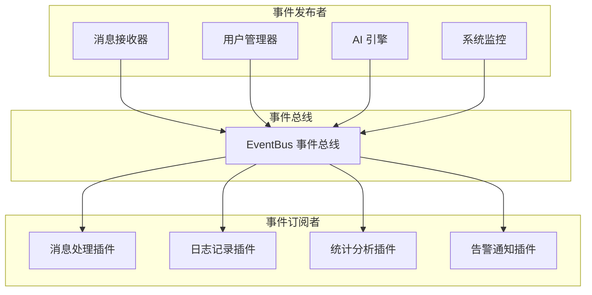
```mermaid
graph TB
    subgraph "事件发布者"
        A1[消息接收器]
        A2[用户管理器]
        A3[AI 引擎]
        A4[系统监控]
    end
    
    subgraph "事件总线"
        B[EventBus 事件总线]
    end
    
    subgraph "事件订阅者"
        C1[消息处理插件]
        C2[日志记录插件]
        C3[统计分析插件]
        C4[告警通知插件]
    end
    
    A1 --> B
    A2 --> B
    A3 --> B
    A4 --> B
    
    B --> C1
    B --> C2
    B --> C3
    B --> C4
```

## 7. Web 管理面板

### 7.1 前端架构设计

#### 7.1.1 前端技术栈

| 技术组件 | 选型 | 用途 |
|----------|------|------|
| **框架** | Vue 3 + TypeScript | 主体框架，类型安全 |
| **UI库** | Element Plus | 组件库，快速开发 |
| **状态管理** | Pinia | 全局状态管理 |
| **路由** | Vue Router 4 | 页面路由管理 |
| **HTTP客户端** | Axios | API 请求处理 |
| **图表库** | ECharts | 数据可视化 |
| **代码编辑器** | Monaco Editor | 配置文件编辑 |

#### 7.1.2 页面功能结构

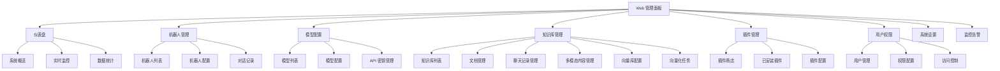
```mermaid
graph TB
    A[Web 管理面板] --> B[仪表盘]
    A --> C[机器人管理]
    A --> D[模型配置]
    A --> E[知识库管理]
    A --> F[插件管理]
    A --> G[用户权限]
    A --> H[系统设置]
    A --> I[监控告警]
    
    B --> B1[系统概览]
    B --> B2[实时监控]
    B --> B3[数据统计]
    
    C --> C1[机器人列表]
    C --> C2[机器人配置]
    C --> C3[对话记录]
    
    D --> D1[模型列表]
    D --> D2[模型配置]
    D --> D3[API 密钥管理]
    
    E --> E1[知识库列表]
    E --> E2[文档管理]
    E --> E3[聊天记录管理]
    E --> E4[多模态内容管理]
    E --> E5[向量库配置]
    E --> E6[向量化任务]
    
    F --> F1[插件商店]
    F --> F2[已安装插件]
    F --> F3[插件配置]
    
    G --> G1[用户管理]
    G --> G2[权限配置]
    G --> G3[访问控制]
```

### 7.2 核心功能页面

#### 7.2.1 机器人管理界面

| 功能区域 | 主要功能 | 交互方式 |
|----------|----------|----------|
| **机器人列表** | 展示所有机器人实例状态 | 表格展示，支持搜索筛选 |
| **快速配置** | 一键创建和部署机器人 | 向导式配置流程 |
| **实时监控** | 监控机器人运行状态 | 实时图表和状态指示器 |
| **配置编辑** | 可视化编辑配置文件 | 表单编辑 + 代码编辑器 |
| **日志查看** | 查看机器人运行日志 | 分页表格，支持实时刷新 |

#### 7.2.2 模型管理界面

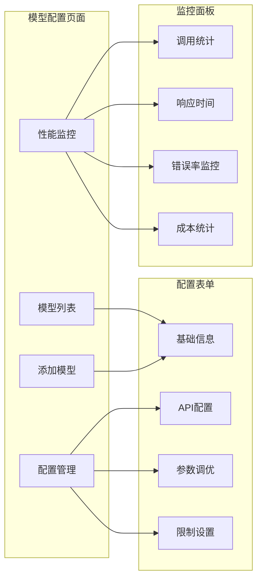
```mermaid
graph LR
    subgraph "模型配置页面"
        A1[模型列表]
        A2[添加模型]
        A3[配置管理]
        A4[性能监控]
    end
    
    subgraph "配置表单"
        B1[基础信息]
        B2[API配置]
        B3[参数调优]
        B4[限制设置]
    end
    
    subgraph "监控面板"
        C1[调用统计]
        C2[响应时间]
        C3[错误率监控]
        C4[成本统计]
    end
    
    A1 --> B1
    A2 --> B1
    A3 --> B2
    A3 --> B3
    A3 --> B4
    
    A4 --> C1
    A4 --> C2
    A4 --> C3
    A4 --> C4
```

## 8. API 接口设计

### 8.1 RESTful API 架构

#### 8.1.1 API 分层设计

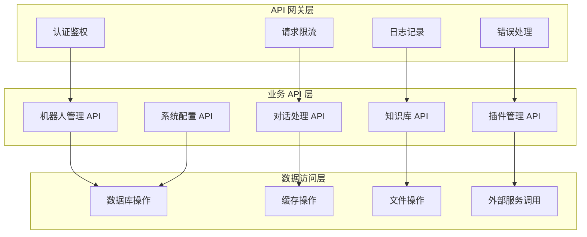
```mermaid
graph TB
    subgraph "API 网关层"
        A1[认证鉴权]
        A2[请求限流]
        A3[日志记录]
        A4[错误处理]
    end
    
    subgraph "业务 API 层"
        B1[机器人管理 API]
        B2[对话处理 API]
        B3[知识库 API]
        B4[插件管理 API]
        B5[系统配置 API]
    end
    
    subgraph "数据访问层"
        C1[数据库操作]
        C2[缓存操作]
        C3[文件操作]
        C4[外部服务调用]
    end
    
    A1 --> B1
    A2 --> B2
    A3 --> B3
    A4 --> B4
    
    B1 --> C1
    B2 --> C2
    B3 --> C3
    B4 --> C4
    B5 --> C1
```

#### 8.1.2 核心 API 端点

| API 分类 | 端点路径 | 主要功能 |
|----------|----------|----------|
| **机器人管理** | `/api/v1/bots` | CRUD 操作、状态控制 |
| **对话处理** | `/api/v1/chat` | 消息发送、对话管理 |
| **模型管理** | `/api/v1/models` | 模型配置、切换 |
| **知识库** | `/api/v1/knowledge` | 文档上传、检索、多模态内容管理 |
| **插件系统** | `/api/v1/plugins` | 插件安装、配置 |
| **用户权限** | `/api/v1/users` | 用户管理、权限控制 |
| **系统监控** | `/api/v1/monitoring` | 状态监控、统计数据 |

### 8.2 WebSocket 实时通信

#### 8.2.1 实时事件推送

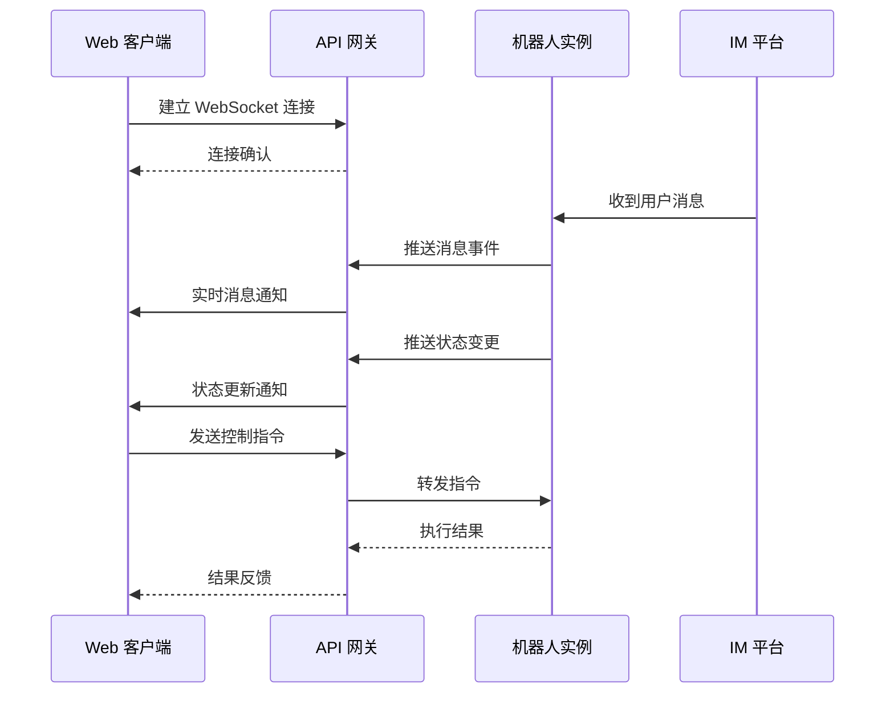
```mermaid
sequenceDiagram
    participant Client as Web 客户端
    participant Gateway as API 网关
    participant Bot as 机器人实例
    participant IM as IM 平台
    
    Client->>Gateway: 建立 WebSocket 连接
    Gateway-->>Client: 连接确认
    
    IM->>Bot: 收到用户消息
    Bot->>Gateway: 推送消息事件
    Gateway->>Client: 实时消息通知
    
    Bot->>Gateway: 推送状态变更
    Gateway->>Client: 状态更新通知
    
    Client->>Gateway: 发送控制指令
    Gateway->>Bot: 转发指令
    Bot-->>Gateway: 执行结果
    Gateway-->>Client: 结果反馈
```

## 9. 数据存储设计

### 9.1 数据库架构

#### 9.1.1 主数据库设计 (MySQL)

```mermaid
erDiagram
    BOTS ||--o{ BOT_CONFIGS : has
    BOTS ||--o{ CONVERSATIONS : owns
    BOTS ||--o{ BOT_PLUGINS : uses
    
    USERS ||--o{ USER_PERMISSIONS : has
    USERS ||--o{ CONVERSATIONS : participates
    USERS ||--o{ CHAT_MESSAGES : sends
    
    CONVERSATIONS ||--o{ CHAT_MESSAGES : contains
    
    KNOWLEDGE_BASES ||--o{ DOCUMENTS : contains
    KNOWLEDGE_BASES ||--o{ CHAT_RECORDS : contains
    KNOWLEDGE_BASES ||--o{ MULTIMODAL_CONTENTS : contains
    DOCUMENTS ||--o{ DOCUMENT_CHUNKS : split_to
    CONVERSATIONS ||--o{ CHAT_RECORDS : exports_to
    
    PLUGINS ||--o{ BOT_PLUGINS : installed_as
    PLUGINS ||--o{ PLUGIN_CONFIGS : configured_by
    
    MODELS ||--o{ MODEL_CONFIGS : has
    MODELS ||--o{ MODEL_USAGE_LOGS : generates
    
    BOTS {
        varchar id PK
        varchar name
        text description
        varchar platform_type
        json platform_config
        varchar status
        datetime created_at
        datetime updated_at
    }
    
    USERS {
        varchar id PK
        varchar platform_user_id
        varchar platform_type
        varchar username
        varchar avatar_url
        json profile_data
        datetime last_active
        datetime created_at
    }
    
    CONVERSATIONS {
        varchar id PK
        varchar bot_id FK
        varchar user_id FK
        varchar chat_type
        varchar platform_chat_id
        json context_data
        datetime started_at
        datetime last_message_at
    }
    
    CHAT_MESSAGES {
        varchar id PK
        varchar conversation_id FK
        varchar user_id FK
        varchar message_type
        longtext content
        json metadata
        datetime created_at
    }
    
    KNOWLEDGE_BASES {
        varchar id PK
        varchar name
        text description
        varchar embedding_model
        varchar vector_store_type
        json vector_store_config
        json config
        datetime created_at
        datetime updated_at
    }
    
    DOCUMENTS {
        varchar id PK
        varchar knowledge_base_id FK
        varchar title
        varchar file_path
        varchar content_type
        varchar source_type
        longtext content
        json metadata
        datetime created_at
    }
    
    DOCUMENT_CHUNKS {
        varchar id PK
        varchar document_id FK
        longtext content
        json embedding
        json metadata
        int chunk_index
        varchar chunk_type
    }
    
    CHAT_RECORDS {
        varchar id PK
        varchar conversation_id FK
        varchar knowledge_base_id FK
        longtext chat_content
        json chat_metadata
        datetime chat_time
        datetime created_at
    }
    
    MULTIMODAL_CONTENTS {
        varchar id PK
        varchar knowledge_base_id FK
        varchar content_type
        varchar file_path
        varchar original_filename
        longtext extracted_text
        json content_metadata
        json embedding
        datetime created_at
    }
    
    PLUGINS {
        varchar id PK
        varchar name
        varchar version
        text description
        varchar author
        json manifest
        datetime created_at
    }
    
    MODELS {
        varchar id PK
        varchar name
        varchar provider
        varchar model_type
        json api_config
        json parameters
        boolean is_active
        datetime created_at
    }
```

#### 9.1.2 缓存设计 (Redis)

| 缓存类型 | Redis Key 模式 | 数据结构 | TTL | 用途 |
|----------|----------------|----------|-----|------|
| **会话缓存** | `session:{bot_id}:{user_id}` | Hash | 24h | 存储对话上下文 |
| **用户状态** | `user_state:{platform}:{user_id}` | String | 1h | 用户在线状态 |
| **限流计数** | `rate_limit:{type}:{id}:{window}` | String | 动态 | 接口调用限流 |
| **模型响应** | `model_cache:{hash}` | String | 1h | 相同请求缓存 |
| **插件数据** | `plugin:{plugin_id}:{key}` | 多种 | 自定义 | 插件临时数据 |

### 9.2 向量数据库设计

#### 9.2.1 多向量库支持架构

```mermaid
graph TB
    subgraph "向量数据库管理层"
        A1[向量库管理器]
        A2[配置管理器]
        A3[路由分发器]
    end
    
    subgraph "本地向量库集群"
        B1[Chroma Local]
        B2[FAISS]
        B3[Qdrant Local]
        B4[ChromaDB]
    end
    
    subgraph "云端向量库集群"
        C1[Pinecone]
        C2[Weaviate Cloud]
        C3[Qdrant Cloud]
        C4[Milvus Cloud]
        C5[阿里云 DashVector]
        C6[腾讯云 VectorDB]
        C7[百度智能云 VectorDB]
    end
    
    subgraph "内容类型分类"
        D1[文本向量集合]
        D2[图像向量集合]
        D3[音频向量集合]
        D4[视频向量集合]
        D5[对话历史向量]
    end
    
    A1 --> A2
    A2 --> A3
    
    A3 --> B1
    A3 --> B2
    A3 --> B3
    A3 --> B4
    
    A3 --> C1
    A3 --> C2
    A3 --> C3
    A3 --> C4
    A3 --> C5
    A3 --> C6
    A3 --> C7
    
    B1 --> D1
    B2 --> D2
    C1 --> D3
    C2 --> D4
    C3 --> D5
```

#### 9.2.2 向量库配置管理

| 向量库类型 | 优势 | 限制 | 推荐场景 |
|------------|------|------|----------|
| **Chroma** | 轻量级，快速部署 | 扩展性一般 | 小型应用，测试环境 |
| **FAISS** | 高性能，本地部署 | 不支持分布式 | 高性能检索，单机部署 |
| **Qdrant** | 支持本地和云端 | 学习成本较高 | 中大型应用 |
| **Pinecone** | 托管服务，高可用 | 成本高，依赖网络 | 生产环境，大规模应用 |
| **Weaviate** | 功能丰富，多模态 | 资源占用高 | 复杂检索需求 |

#### 9.2.3 向量库切换机制

```mermaid
sequenceDiagram
    participant Admin as 管理员
    participant UI as Web管理面板
    participant Config as 配置管理器
    participant VectorMgr as 向量库管理器
    participant OldDB as 旧向量库
    participant NewDB as 新向量库
    
    Admin->>UI: 选择新向量库配置
    UI->>Config: 提交配置变更
    Config->>VectorMgr: 验证新配置
    VectorMgr->>NewDB: 测试连接
    NewDB-->>VectorMgr: 连接成功
    
    VectorMgr->>Config: 开始迁移数据
    Config->>OldDB: 导出向量数据
    OldDB-->>Config: 返回数据
    Config->>NewDB: 导入向量数据
    NewDB-->>Config: 导入完成
    
    Config->>VectorMgr: 切换路由
    VectorMgr-->>Config: 切换完成
    Config-->>UI: 通知切换结果
    UI-->>Admin: 显示切换成功

## 10. 部署与运维

### 10.1 容器化部署

#### 10.1.1 Docker 容器架构

```mermaid
graph TB
    subgraph "负载均衡层"
        A[Nginx/Traefik]
    end
    
    subgraph "应用容器"
        B1[Web UI 容器]
        B2[API 服务容器]
        B3[Bot 引擎容器]
        B4[任务队列容器]
    end
    
    subgraph "数据容器"
        C1[MySQL 容器]
        C2[Redis 容器]
        C3[向量数据库容器]
    end
    
    subgraph "存储卷"
        D1[配置文件卷]
        D2[日志文件卷]
        D3[知识库文件卷]
        D4[插件文件卷]
    end
    
    A --> B1
    A --> B2
    
    B1 --> C1
    B2 --> C1
    B3 --> C1
    B4 --> C2
    
    B2 --> C3
    B3 --> C3
    
    B1 --> D1
    B2 --> D2
    B3 --> D3
    B4 --> D4
```

#### 10.1.2 Docker Compose 配置结构

| 服务组件 | 镜像版本 | 端口映射 | 依赖关系 |
|----------|----------|----------|----------|
| **nginx** | nginx:alpine | 80:80, 443:443 | - |
| **web-ui** | node:18-alpine | 3000:3000 | api-server |
| **api-server** | python:3.11-slim | 8000:8000 | mysql, redis |
| **bot-engine** | python:3.11-slim | - | mysql, redis, vector-db |
| **mysql** | mysql:8.0 | 3306:3306 | - |
| **redis** | redis:7-alpine | 6379:6379 | - |
| **vector-db** | qdrant/qdrant | 6333:6333 | - |

### 10.2 监控与告警

#### 10.2.1 监控指标体系

```mermaid
graph TB
    subgraph "基础设施监控"
        A1[CPU 使用率]
        A2[内存使用率]
        A3[磁盘 I/O]
        A4[网络流量]
    end
    
    subgraph "应用性能监控"
        B1[API 响应时间]
        B2[请求成功率]
        B3[并发连接数]
        B4[队列长度]
    end
    
    subgraph "业务指标监控"
        C1[消息处理量]
        C2[用户活跃度]
        C3[模型调用次数]
        C4[插件执行状态]
    end
    
    subgraph "告警系统"
        D1[邮件通知]
        D2[企业微信通知]
        D3[短信告警]
        D4[WebHook 回调]
    end
    
    A1 --> D1
    A2 --> D2
    B1 --> D3
    C1 --> D4
```

## 11. 开发规范与扩展

### 11.1 插件开发规范

#### 11.1.1 插件开发模板

```mermaid
classDiagram
    class PluginBase {
        +name: str
        +version: str
        +description: str
        +author: str
        +dependencies: List[str]
        +config_schema: Dict
        +initialize() -> bool
        +destroy() -> bool
        +get_info() -> Dict
    }
    
    class MessagePlugin {
        +on_message_received(message: Message) -> bool
        +process_message(message: Message) -> Message
        +on_message_sent(message: Message) -> bool
    }
    
    class CommandPlugin {
        +commands: List[str]
        +handle_command(command: str, args: List[str]) -> str
        +get_help() -> str
    }
    
    class ScheduledPlugin {
        +schedule: str
        +execute() -> bool
        +get_next_run() -> datetime
    }
    
    PluginBase <|-- MessagePlugin
    PluginBase <|-- CommandPlugin
    PluginBase <|-- ScheduledPlugin
```

#### 11.1.2 插件配置规范

| 配置项 | 类型 | 必需 | 说明 |
|--------|------|------|------|
| **name** | string | 是 | 插件唯一名称 |
| **version** | string | 是 | 语义化版本号 |
| **description** | string | 是 | 插件功能描述 |
| **author** | string | 是 | 插件作者信息 |
| **entry_point** | string | 是 | 插件入口文件 |
| **dependencies** | array | 否 | 依赖的其他插件 |
| **permissions** | array | 否 | 需要的权限列表 |
| **config_schema** | object | 否 | 配置参数模式 |

### 11.2 API 扩展机制

#### 11.2.1 自定义 API 开发

```mermaid
graph LR
    A[自定义 API] --> B[路由注册]
    B --> C[权限验证]
    C --> D[参数验证]
    D --> E[业务逻辑]
    E --> F[响应格式化]
    
    subgraph "扩展点"
        G1[中间件扩展]
        G2[数据验证扩展]
        G3[响应处理扩展]
    end
    
    C --> G1
    D --> G2
    F --> G3
```

## 12. 测试策略

### 12.1 测试金字塔

#### 12.1.1 测试层级设计

```mermaid
graph TB
    subgraph "集成测试 (30%)"
        A1[API 接口测试]
        A2[平台适配测试]
        A3[插件集成测试]
    end
    
    subgraph "单元测试 (60%)"
        B1[核心业务逻辑]
        B2[工具函数测试]
        B3[数据模型测试]
    end
    
    subgraph "端到端测试 (10%)"
        C1[完整对话流程]
        C2[Web 界面测试]
        C3[部署验证测试]
    end
    
    C1 --> A1
    C2 --> A2
    C3 --> A3
    
    A1 --> B1
    A2 --> B2
    A3 --> B3
```

### 12.2 测试自动化

#### 12.2.1 CI/CD 流水线

| 阶段 | 触发条件 | 执行内容 | 通过标准 |
|------|----------|----------|----------|
| **代码检查** | 每次提交 | 代码格式化、静态分析 | 无语法错误，符合编码规范 |
| **单元测试** | 每次提交 | 运行所有单元测试 | 测试覆盖率 > 80% |
| **集成测试** | PR 合并 | 模块间集成测试 | 所有集成测试通过 |
| **端到端测试** | 发布前 | 完整功能验证 | 核心功能正常运行 |
| **性能测试** | 重大版本 | 压力测试、性能基准 | 满足性能指标要求 |